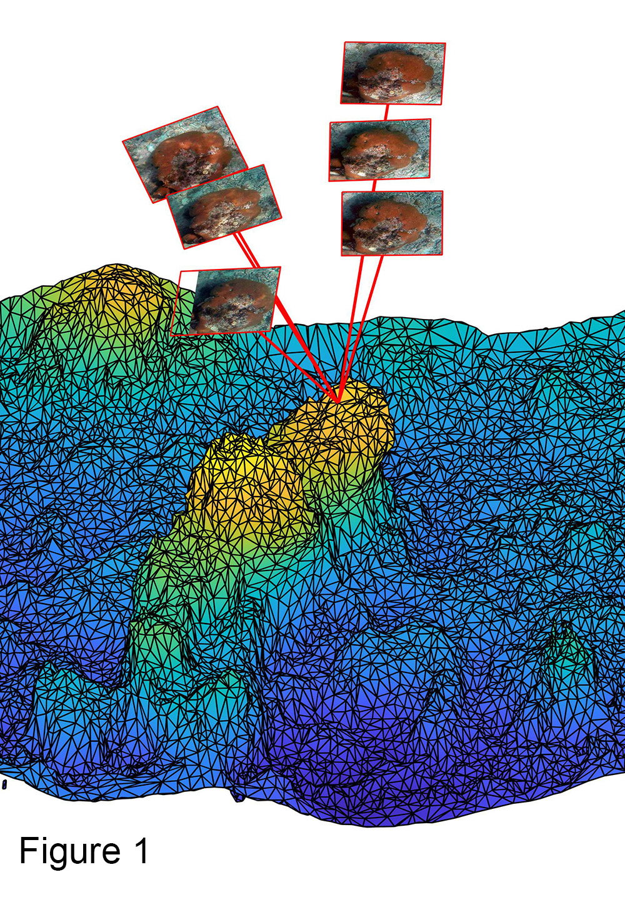
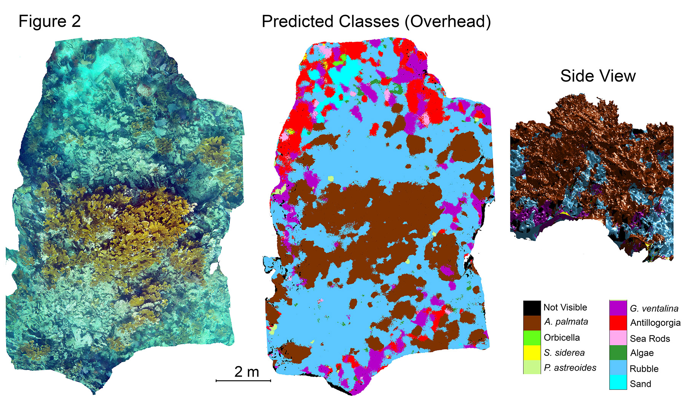

# Classification of 3D reef reconstructions
CNN classification of coral reefs from images using multiple views (Figure 1)

implements the method described in:
Hopkinson, B. M., A. C. King, D. P. Owen, M. Johnson-Roberson, M. H. Long, S. M. Bhandarkar. Automated classification of three-dimensional reconstructions of coral reefs using convolutional neural networks. PloS ONE 15(3): e0230671

#nViewNet Training
1. CNN model training and testing scripts are in the "training_testing" folder.
A small sample data set is provided. To begin training ResNet152 run 'train_on_mesh.py" setting parameters as described in the documentation of this file.

2. Once a ResNet152 image patch classifier has been trained, nViewNet can be trained by modifing the parameters in 'train_on_mesh.py' as described in the documentation of that file.
'train_on_mesh.py' makes use of the nViewNet model (nviewnet_v2.py) and a custom dataset class (meshtrain_dataset.py, which uses meshview_dataset_helpers.py')
Voting and averaging approaches to merging information from multiple views are implemented in 'voting_avering_ResNet152.py'

# Predictions on meshes
 A trained nViewNet model can be used to make predictions on an entire 3D mesh using the scripts in "large-scale_prediction". The key script is 'mesh_inference_nviewnet.py', which makes use of a custom dataset 'meshview_dataset.py'. Sample data is provided. 

Primary dependencies: PyTorch (0.40), numpy, scipy, opencv
